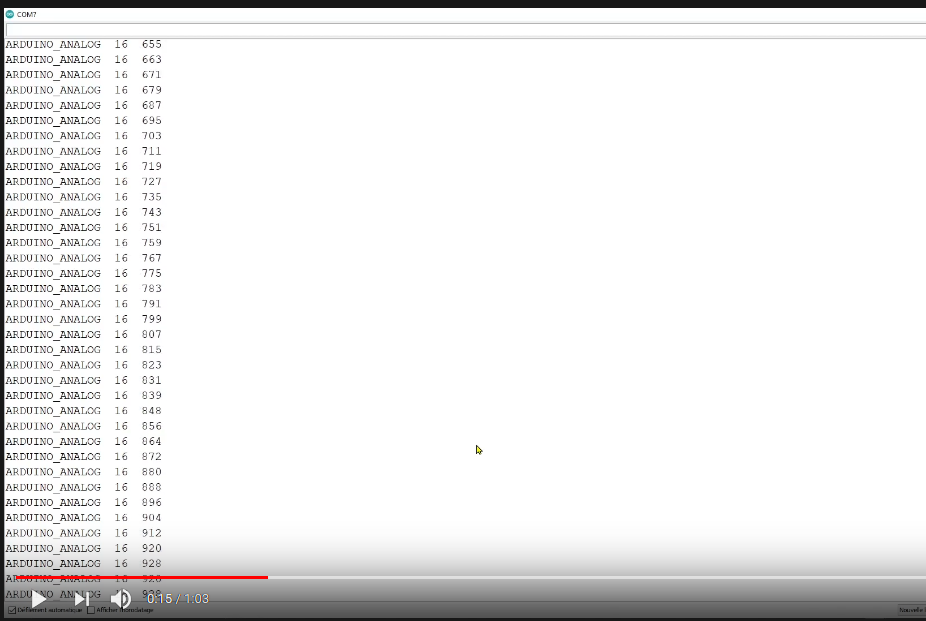

# ARDUINO WITH 2_X_CD4051_INPUT

- [ARDUINO WITH 2_X_CD4051_INPUT](#arduino-with-2_x_cd4051_input)
  - [From this schematic :](#from-this-schematic-)
  - [Video test link](#video-test-link)
  - [Compilation with #define TEST](#compilation-with-define-test)
  - [Compilation without #define TEST](#compilation-without-define-test)
  - [More infos](#more-infos)

## From this schematic :

## Video test link

## Compilation with #define TEST
Like the video.

## Compilation without #define TEST
To use the Arduino like a USB controller.

## More infos

Enjoy !

